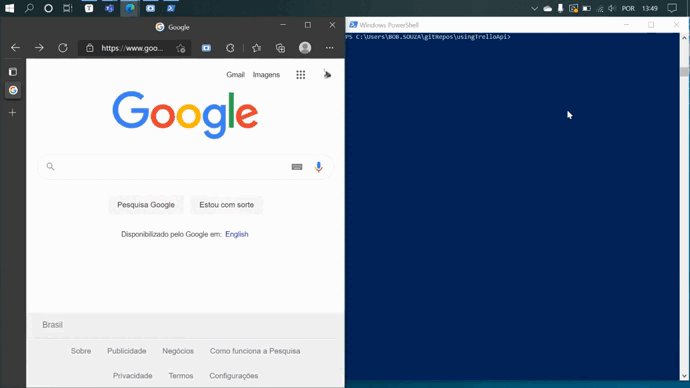

## Automatizando Trello com Nodejs

<p align="center"></p>

<p align="center">
    <a href="https://developer.atlassian.com/cloud/trello/rest/api-group-actions/" target="_blank">
 
	</a> 
</p>


A API do Trello, além de bem documentada, traz diversos métodos para manipular informações na plataforma. 

Assim se pode, desenvolver ferramentas para auxiliar na organização de boards.


_O programa aqui desenvolvido é um exemplo de como pode ser usada a API do Trello._

**Com essa aplicação é possível:**

-  Criar um board

- Ver as listas contidas no board

- Inserir cards a uma lista 

- Editar ou  excluir cards

Sem precisar sair do terminal :smile:


<p align="center"><strong>É preciso ter instalado</strong></p>

<p align="center">
 
 
 
 </p>

<br>

### Como instalar:

Clone o Repositório:
```bash
git clone https://github.com/bob-mw/using-trello-api.git
````

Entre na pasta:
```bash
cd using-trello-api
```

Instale as dependências:
```bash
npm install
```

<br>

### Como usar:

### Key e Token
Crie um arquivo chamado `.env` no diretório, nele coloque sua key e token do trello, como no exemplo abaixo:

```
key=f7sdfs987df987sf987fsf7s
token=s69fd87sa98df79a8sd7f9sa8d7f9sa8d7f9s8ad7f9as
```

Se não sabe sua key e token do trello é possível obter essas informações em http://trello.com/app-key

<br>
<br>

### Criando um novo Board
Com sua key e token salvas no arquivo .env, abra o terminal e execute o arquivo `createBoard.js`:
```bash
node createBord.js
```
_Ao executar será pedido o nome do Board a ser criado_

<br>
<br>

###  Visualizar listas do board
Ao criar um novo board, o trello cria automaticamente três listas: `A fazer`, `Andamento`, `Concluido`

Para vizualizar as listas que estão no board execute o arquivo `getListsOnBoard.js`:
```bash
node getListsOnBoard.js
```
_Ao executado será pedido o ID do Board_

<br>
<br>

### Criando Cards

Crie um arquivo `json` onde ira colocar as informações dos cards a serem criados.
_Nesse projeto criaremos cards simples com apenas titulo de descrição_

exemplo de arquivo `cards.json`:

```json
[
    {
        "name": "Task 1",
        "desc": "**Descricao**\n\n Descricao da tarefa\n Tarefa criada para testar API do Trello"
    },
    {
        "name": "Task 2",
        "desc": "**Descricao**\n\n Descricao da tarefa\n Tarefa criada para testar API do Trello"
    }
]
```

_Para criar cards a API não aceita acentos ou caracteres como `ç`_

Após criar o arquivo, execute o arquivo `createCards.js`

```bash
node createCards.js
```

_Ao executar será pedido o nome do arquivo onde estão as informações do seu card, **nessa passo não precisa colocar o .json no final do nome**_

_Depois será pedido o ID da lista onde que inserir os cards_

<br>
<br>

### Visualizar cards da lista

Execute o arquivo `readList.js`:

```bash
node readList.js
```

_Será pedido a ID da lista_

<br>
<br>

## Editar card

Execute o arquivo `updateCard.js`:

```bash
node updateCard.js
```

_Será pedido o ID do card que deseja editar, nome e descrição._

<br>
<br>

### Excluir card

Execute o arquivo `destroyCard.js`:

```bash
node destroyCard.js
```

_Será pedido o ID do card que sera excluido_

<br>
<br>

### Referências

[The Trello REST API (atlassian.com)](https://developer.atlassian.com/cloud/trello/rest/api-group-actions/)

